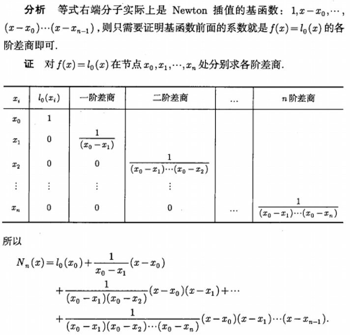
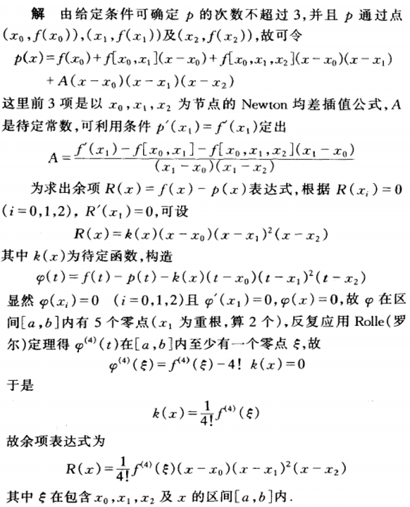
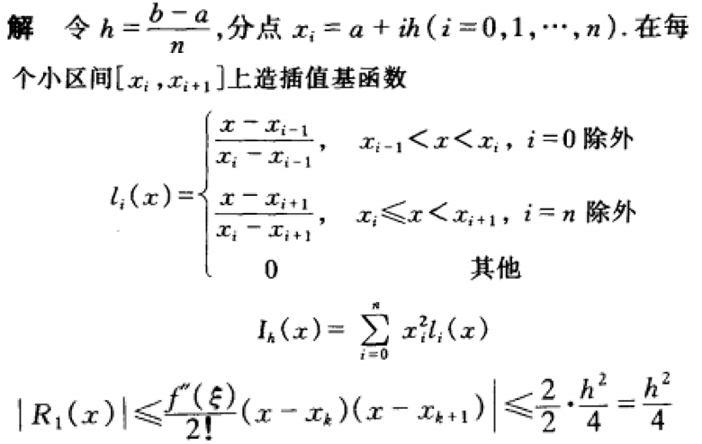

### 1. 设xi（i=0,1,2,3,4）为互异节点，li(x)为对应的4次拉格朗日插值基函数，则，分别等于什么。

> 0
>
> x4+2
>
> 
>
> 四个节点对于四次多项式插值，结果是收敛的，所以插值后得到的就是l(x)前面的式子。
>
> 也就是求 y=x4在x=0时的值。
>
> 就等于x4+2。

### 2.已知，xi互异，证明：

### 

> 要利用牛顿插值的延续性。~~事实上可以直接通分得到，但我这么做被扣了分。~~
>
> 

### 3. 求多项式p(x)，满足条件p(xi)=f(xi),(i=0,1,2). p'(x1)=f'(x1). 并求余项表达式。

> 
>
> 不能直接用埃尔米特插值的公式，因为只给出了一个点的导数，而埃尔米特插值需要全部节点的导数值。

### 4. 求 f(x)=x2  在区间[a，b]上的 n 等分分段线性插值函数并估计误差。

> 